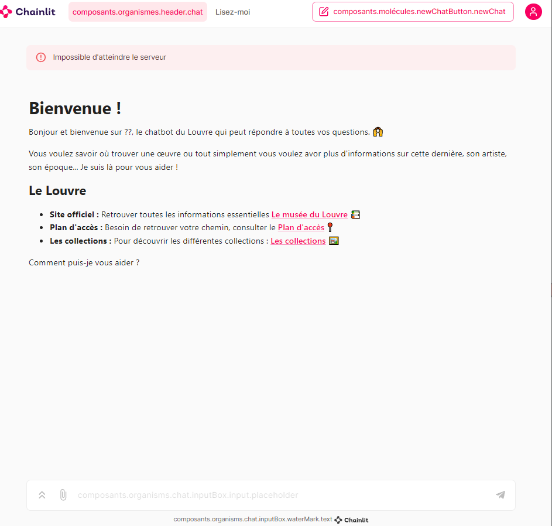

# IABot

## Qui ? 
Nous avons travailler sur ce projet en collaboration : 
* Héloïse LE GELDRON
* Anaëlle RAVON
* Emma-Loïse QUIN HERVET

## Notre projet : 
Le but de notre projet est de concevoir un chatbot pour assister les visiteurs du Louvre dans leurs recherches d'œuvres d'art. 
Nos objectifs sont : 
* Remplacer l’audio-guide
* Donner des informations pertinentes à l’utilisateur 
* Guider l’utilisateur à travers le musée

Voici un apreçu : 



> Ce projet est en cours de modification.

## Installation : 
Voici la liste des installations : 

1. Python : Téléchargez Python en suivant ce lien : https://www.python.org/downloads/windows/

2. LanChain : LangChain simplifie le développement en intelligence artificielle (IA) en supprimant la complexité des intégrations de sources de données. Suivez les consignes d'installation suivante : 
```
pip install langchain
pip install langchain_experimental
pip install langchain-openai
pip install openai
pip install openai langchain sentence_transformers -q
pip install langchain-community
pip install langsmith
```
3. Beautiful Soup : Cette bibliothèque Python permet d'extraire du contenu et de le transformer en une liste, un tableau ou un dictionnaire Python.
```
pip install beautifulsoup4
```

4. Requests : Permet d'envoyer des requêtes HTTP/1.1 en utilisant Python.
```
pip install requests
```

5. Pandas : Cette bibliothèque permet la manipulation et l'analyse de données.
```
pip install pandas
```

6. Autres : 
Voici la liste des autres installations nécessaires 

```
pip install tabulate
```